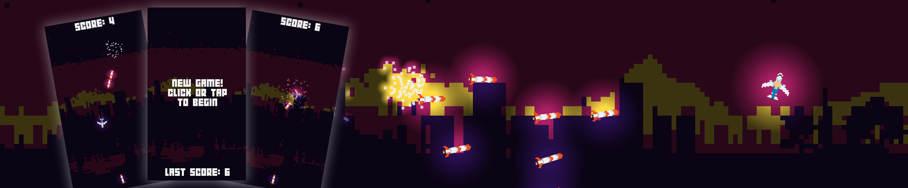

# Web Application Development

This repository contains a collection of projects developed for the course CES-26: Web Application Development at ITA (Instituto Tecnológico de Aeronáutica, Brazil). Each project is organized within its own folder and showcases the skills and concepts learned throughout the course. The following projects were developed throught the course:

+ [High School Webpage](https://emmanuelsdias.github.io/web-app-dev/high-school-webpage/)
+ [Plane and Missile](https://emmanuelsdias.github.io/web-app-dev/plane-and-missile/)
+ [DOM Tree](https://emmanuelsdias.github.io/web-app-dev/dom-tree/)
+ [Pixel Art Editor](https://pixel-art-editor.azurewebsites.net/creation)

## High School Webpage 

This project involved building a set of web pages with information about my High School. The pages should be directed towards four different groups: students, professors, administration, and outside visitors, applying a different style to each of their pages. Additionally, the pages should be responsive. The project's website [can be viewed here](https://emmanuelsdias.github.io/web-app-dev/high-school-webpage/).

### Development process

To develop my High School's webpage, I began by studying my High School's existing website, extracting its logo, colors, and header style, which I then incorporated into the project. Additionally, I sourced images of the school from its official Facebook page. Utilizing the assistance of ChatGPT's AI, I generated dummy content for each of the website's pages. Subsequently, on nearly every page (excluding the administration one), I aimed to introduce distinctive elements beyond mere text. These unique features, such as slideshows and location maps, were initially implemented by the AI. However, in most cases, they required further refinement due to functional issues. To address these challenges, I conducted online research, referring to documentation and seeking out similar problems and their solutions.

### Lessons learned

Throughout the project, I learned the foundations of HTML, CSS, and Javascript, as well as how to structure files in an organized manner. Although I attempted to reuse the header, navigation bar, and footer codes by appending them to external `.html` files and then importing them using scripts, I was not satisfied with the end result (blinking of the header etc. due to the loading time of the scripts). In the end, I chose to duplicate the code throughout all the pages, focusing on providing a better user experience. This project was also a great opportunity to learn about efficiently grouping elements together to target them with CSS and to explore basic ways of implementing responsiveness in a website.

## Plane and Missile 

This project involved building an interactive animation, featuring a plane that follows the cursor's movement, and a missile that points towards the plane's position. Upon left-clicking, the missile is launched towards the plane and, upon impact, triggers an explosion. The animation should include sound effects, with the ability to toggle sound on or off. 

However, the project ended up being expanded outside the original prompt. Some features were added, such as multiple missiles, self collisions and a score. This project combined canvas rendering, user interaction and sound effects to provide a fast-paced mobile-friendly minigame experience! Font and sounds are credited in the assets folder, while the artwork was done by myself (plane pixel art inspired by Embraer's original E2 colors). [Play it here!](https://emmanuelsdias.github.io/web-app-dev/plane-and-missile/).

### Development process

To develop the animation, I began by making a prototype which fulfilled the original prompt. Once the mechanics worked properly, features were added gradually and, after completing them, the final artwork was created to bring the whole experience together. After that, the plane death and new game screen state were added, to give it a replay value. The end touches were making the whole thing mobile-friendly, which involved handling multiple touches to enable the player to move the plane while launching new missiles.

### Lessons learned

Throughout the project, I learned how to use the canvas from HTML, handling multiple canvases and overlaying them. Also, listeners were studied to properly handle the user interaction with the game. Finally, it was a great way to learn mobile stuff such as handling multiple touches and blocking unwanted actions (scrolls, double-taps and pinch zoom).

## DOM Tree 

This project involved creating a DOM (Document Object Model) tree editor using jQuery. The primary goal was to provide a user-friendly interface for manipulating elements within a DOM tree. The user should be able to select the tree nodes, changing their colors upon selection. Finally, they should be able to add, edit or remove an element. The DOM Tree [can be viewed here](https://emmanuelsdias.github.io/web-app-dev/dom-tree/).

### Development process

First, I created a simple DOM tree and spent a significant amount of time trying to add the branches (paths) and leaves (circles) connecting the items. Then, using jQuery, I added the ability to select a node, changing their color upon selection. Afterward, I implemented the ability to create, edit, and remove nodes. Finally, I replaced the default alerts/prompts with custom alert/prompt boxes, the designs of which I could customize.

### Lessons learned

Throughout the project, I gained a solid understanding of fundamental jQuery concepts. I learned how to utilize jQuery's methods for selecting elements and performing various CRUD (Create, Read, Update, Delete) operations on them. Additionally, I created custom alert and prompt dialog boxes, which could be tailored to match the project's theme and aesthetics.

However, I recognize that the handling of click events could have been more organized and efficient. Additionally, the functions responsible for submitting input dialogs would benefit from better communication with other functions. A more streamlined approach, involving the passing of parameters rather than multiple document searches for data retrieval, would enhance code clarity and maintainability.

## Pixel Art Editor

This project involved the development of a server application using Node.js and Express, complemented by AJAX requests, GET and POST form data handling, and file uploading capabilities. Expanding upon the initial concept, the project evolved into a web application which allowed users to create pixel art and subsequently upload it to a dedicated gallery. The gallery, in turn, showcases all the artwork uploaded to date. You can access the Pixel Art Editor [here](https://pixel-art-editor.azurewebsites.net/gallery). 

### Development process

The development process presented some challenges, especially since I had limited experience with backend programming. Initially, I grappled with determining the optimal project structure and ended up relying on the default Express structure provided during project initialization. Deploying the application to the Azure cloud was relatively straightforward. The most intricate aspect was deciphering the backend code and its interactions within the application. While the project appears to function correctly, I think that I may not have adhered to best practices throughout.

### Lessons learned

Over the course of this project, I got a bit more used to backend programming and routing within a web server application. I also learned to deploy a Node.js application to the cloud. Looking ahead, I intend to enhance the project's structure to better fit it to good practices and explore the possibility of hosting the frontend and backend separately. This approach would enable me to host its frontend on Github Pages, similar to the previous projects.